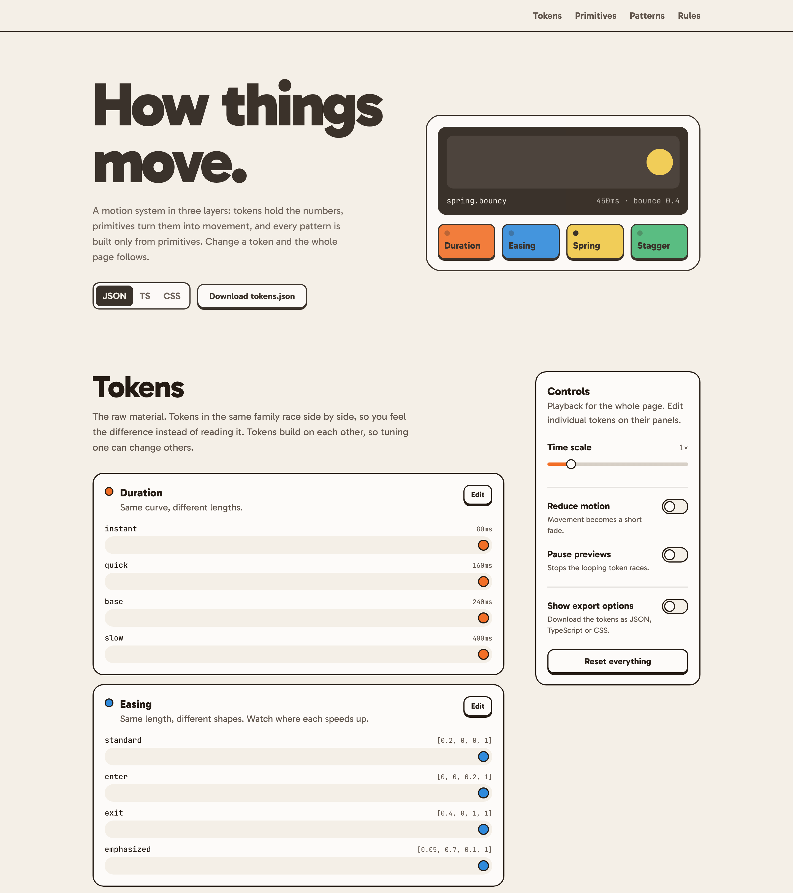

# Motion System

A motion system in three layers: tokens, primitives that read them, and real UI patterns built only from those primitives. It ships with a playground where you tune springs and drag easing curves live, watch every demo follow, then export the tokens as JSON, TypeScript or CSS.

**Live:** [motion-system-playground.vercel.app](https://motion-system-playground.vercel.app/)



## Key decisions

- **Springs use duration and bounce.** You set how long a spring takes and how much it bounces, not physics settings like stiffness.
- **Only springs bounce.** Easing curves always move smoothly from start to end. Springs are the only thing that goes past the target, and bounce is capped so it never looks cartoonish.
- **Tokens live in a standard JSON file.** It takes one extra conversion step, but design tools like Tokens Studio can read the same file.
- **Tokens race side by side.** Each token animates on the same track at the same time, so you can see the difference instead of comparing numbers.

```bash
npm install
npm run dev      # http://localhost:5173
npm run build    # type-check + production build
```

## Three layers

Each layer only uses the one above it.

| Layer | Folder | What it is |
|---|---|---|
| **1.&nbsp;Tokens** | `src/tokens/` | The numbers: durations, easings, springs, stagger, distance, scale. All in `tokens.json`. |
| **2.&nbsp;Primitives** | `src/motion/` | Components that turn tokens into movement: `Reveal`, `Presence`, `Stagger`, `Move`, `Shuttle`. The only code that uses the animation library. |
| **3.&nbsp;Patterns** | `src/patterns/` | Real UI built only from primitives: modal, list, toast. No timing values of their own. |

The rest of the code:

- **`src/playground/`**: the demo page (hero instrument, token races, tuning, controls, export).
- **`src/ui/`**: plain inputs (Button, Slider, Select, Toggle, SegmentedControl, CurveEditor).

## tokens.json is the source of truth

Every motion value lives in one file: [`src/tokens/tokens.json`](src/tokens/tokens.json). It uses the [W3C Design Tokens (DTCG)](https://www.designtokens.org/) format, so tools like Tokens Studio and Style Dictionary can read it too.

`src/tokens/motion.ts` reads the file and rejects bad values, like an easing curve outside 0–1. It also turns token names into TypeScript types, so a typo like `'bouncyy'` is caught.

### Exporting tokens

Download the tokens from the playground in three formats:

| Format | What you get |
|---|---|
| **JSON** | The `tokens.json` file itself |
| **TypeScript** | Typed constants, plus types for every token name |
| **CSS** | Custom properties on `:root` |

- **They never drift apart.** TypeScript and CSS are generated from the JSON when you click download (`src/tokens/exporters.ts`).
- **Edited or original.** After editing in the playground (the **Edit** button on each panel), choose whether to export your edited values or the original file. Edited JSON keeps every `$type` and `$description`; only the values change.
- **Time scale is never exported.** It's playback speed for previewing, not a token.
- **Springs in CSS:** CSS has no spring timing, so springs export as a duration and a bounce for JavaScript to read.

## How a token reaches the screen

1. `tokens.json` defines `quick` as 160ms; `tokens/motion.ts` reads it.
2. `MotionConfigProvider` applies the playground's settings (time scale, spring edits, reduced motion) and
   - hands the resolved tokens to primitives through context, and
   - writes them to CSS variables (`--duration-quick`, `--ease-standard`) on `:root`.
3. JS animations use `useMotionToken().tween('quick', 'exit')`, and CSS transitions use Tailwind classes like `duration-(--duration-quick) ease-standard`. Both stay in sync.

## Rules

- **Only `src/motion/` imports `motion`.** Everything else uses primitives, so the animation library could be swapped in one folder.
- **No raw timing values outside `tokens.json`.** Components ask for `'quick'`, never `160`.
- **Exits are faster than entrances.** Presence enters with a spring and leaves with `quick` + `exit`.
- **Reduced motion is handled once.** Following the OS setting or the playground toggle, movement is switched off in both JS and CSS animations, leaving only fades.
- One component per file, typed props, variants as typed maps + `cn()`.
